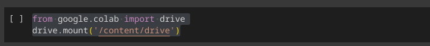
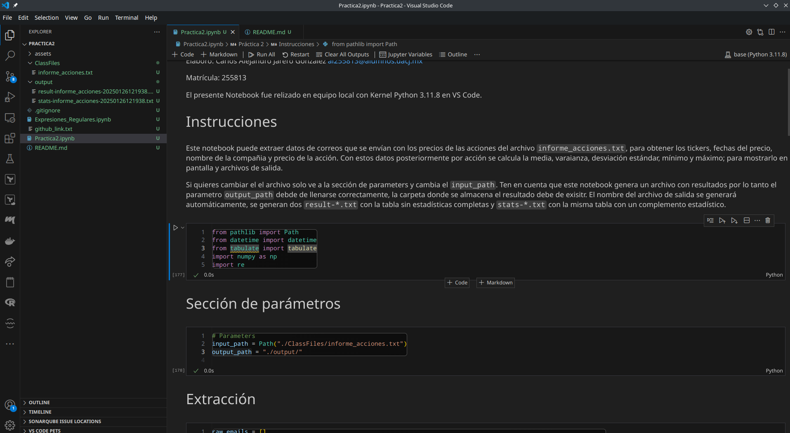
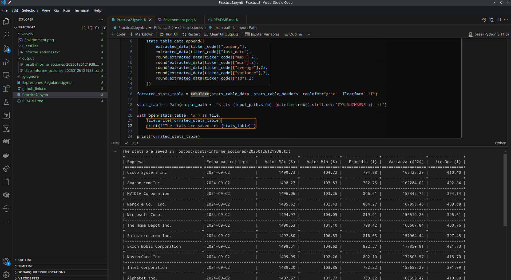

# Práctica 2: Extracción de Información con Expresiones Regulares

Elaboró: Carlos Alejandro Jarero Gonzalez <al255813@alumnos.uacj.mx>

Matrícula: 255813

El presente Notebook fue relizado en equipo local con Kernel Python 3.11.8 en VS Code.

## Instrucciones

Este notebook puede extraer datos de correos que se envían con los precios de las acciones del archivo ```informe_acciones.txt```, para obtener los tickers, fechas del precio, nombre de la compañia y precio de la acción. Con estos datos posteriormente por acción se calcula la media, varaianza, desviación estándar, mínimo y máximo; para mostrarlo en pantalla y archivos de salida.

Si quieres cambiar el el archivo solo ve a la sección de parameters y cambia el ```input_path```. Ten en cuenta que este notebook genera un archivo con resultados por lo tanto el parametro ```output_path``` debde de llenarse correctamente, la carpeta donde se almacena el resultado debe de exisitr. El nombre del archivo de salida se generará automáticamente, se generan dos ```result-*.txt``` con la tabla sin estadísticas completas y ```stats-*.txt``` con la misma tabla con un complemento estadístico.

### Si usas Google Colab

1. Ve a la sección de Files y asegurate de tener habilitado el acceso a tu Google Drive, de lo contrario hablitalo y dale los permisos correspondientes.
2. Si ya has realizado el paso anterior verás en tu notebook la siguiente instrucción de python para montar un volumen en el caso de linux ```/content/drive```, esto puede cambiar en diferentes sistemas operativos.

3. Asegurate de ejecutar la sección previa, dependidendo si ya has dado o no los permisos en este paso puede que de nuevo te solicite darle permiso. 
4. Ahora verás um directorio llamado drive donde encontarás tu Drive, ahí sube el archvio a procesar.
5. Copia el path absoluto de archivo de ```informe_acciones.txt``` en ```input_path```.
6. Este notebook guarda los resultados archivos por lo tanto es necesario configurar el path de salida ```output_path```, asegurate de poner el path absoluto y que dicha carpeta exista, de lo contrario aparecerá un error.

## Objetivos

- Obtener datos de una fuente no estrucutrada sobre cotización de acciones en bolsa a partir informes de acciones enviadas por correo electrónico.
- Con los datos de cotización utilizar medidas de tendencia central (promedio), dispersión (varianza y desivación estándar) y posición (mínimo y máximo). Que son los datos mínimos para la toma de desiciones.

## Capturas de pantalla



### Ambiente de trabajo

